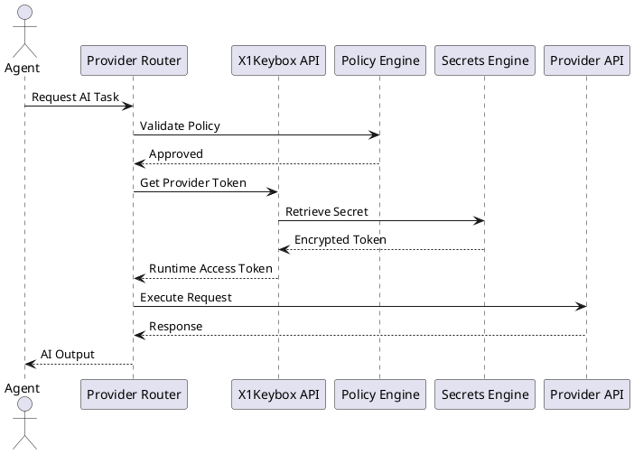
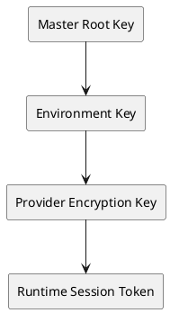
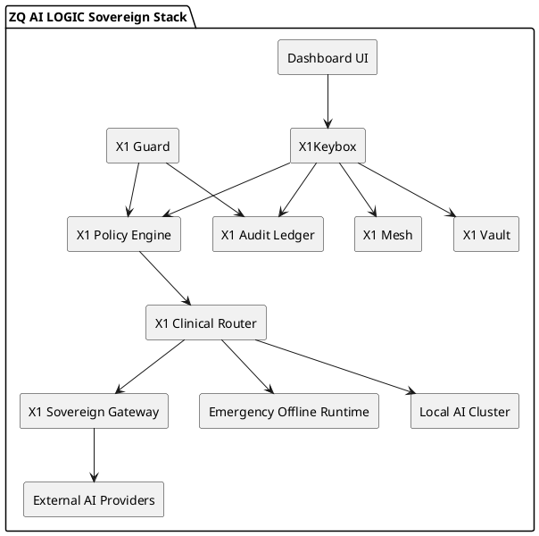
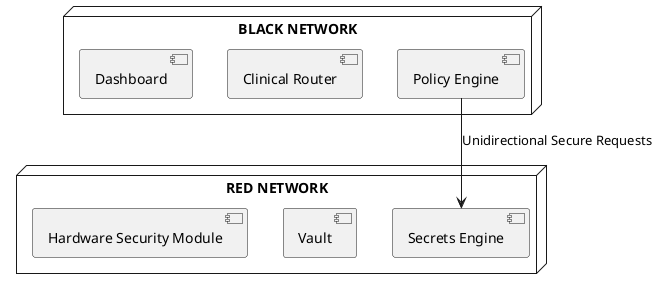

# SPEC-001-ZQ-X1Keybox

## Background

ZQ X1Keybox™ is designed as the sovereign trust anchor for ZQ AI LOGIC™. Modern AI systems increasingly rely on multiple providers, distributed runtimes, cloud and offline execution environments, and dynamic orchestration between models.

Traditional API key handling methods are insecure, fragmented, difficult to govern, and incompatible with sovereign or air-gapped AI architectures.

ZQ X1Keybox™ solves this by introducing a dedicated infrastructure-grade credential and runtime access layer that:

* securely manages AI provider credentials
* enforces sovereign runtime policies
* isolates secrets from AI agents
* supports multi-provider orchestration
* enables offline and air-gap AI execution
* becomes the central policy authority for AI runtime access

The system is intended to operate across:

* enterprise cloud environments
* local sovereign AI deployments
* edge devices
* secure defense-grade infrastructure
* hybrid AI execution networks

ZQ X1Keybox™ is not merely an API key manager.

It is the security and trust infrastructure layer for all AI execution inside ZQ AI LOGIC™.

---

## Requirements

### Must Have (M)

#### Core Credential Management

* Securely store AI provider credentials
* Support:

  * OpenAI
  * Gemini
  * Claude
  * Groq
  * OpenRouter
  * Azure OpenAI
  * Ollama local profiles
* Runtime credential retrieval
* Provider add/remove/update
* Credential rotation
* Connection testing
* Runtime provider switching

#### Security

* AES-256 encryption at rest
* TLS 1.3 transport security
* Zero plaintext secret logging
* Memory-safe secret handling
* JWT signing support
* Session expiration
* Encrypted local cache
* Hardware-backed encryption support
* Air-gap compatible mode

#### Runtime Policies

* Provider allowlists
* Regional restrictions
* Offline-only mode
* Air-gap mode
* Model governance policies
* Runtime permission enforcement

#### APIs

* REST API
* gRPC internal API
* CLI support
* SDKs:

  * Python
  * TypeScript
  * Go

#### Infrastructure

* Docker deployment
* Kubernetes deployment
* Vault integration
* SQLite encrypted storage
* PostgreSQL support
* Multi-platform support

---

### Should Have (S)

* Biometric unlock
* FIDO2 hardware key support
* Multi-tenant support
* Provider trust scoring
* Automatic failover
* Dynamic routing engine
* Runtime audit trails
* Security event monitoring
* Rate limiting
* Distributed key replication

---

### Could Have (C)

* Distributed sovereign mesh
* Decentralized node trust
* Federated provider governance
* Edge runtime synchronization
* Blockchain-backed audit verification

---

### Won't Have Initially (W)

* Consumer password vault functionality
* Browser extension password manager
* Direct AI model hosting
* Public marketplace integrations

---

## Method

### High-Level Architecture

```plantuml
@startuml
skinparam componentStyle rectangle

package "ZQ AI LOGIC" {

[UI Dashboard]

[Provider Router]

[AI Runtime]

component "X1Keybox API" as API
component "Secrets Engine" as Secrets
component "Policy Engine" as Policy
component "Encryption Layer" as Crypto
component "Secure Storage" as Storage
component "Audit Engine" as Audit

[UI Dashboard] --> API
API --> Secrets
API --> Policy
Secrets --> Crypto
Crypto --> Storage
Policy --> Provider Router
Provider Router --> AI Runtime
API --> Audit

}
@enduml
```

---

### Core Runtime Flow



---

### Security Model

#### Zero Secret Exposure Principle

Secrets must:

* never enter agent memory
* never be serialized into prompts
* never appear in telemetry
* never be written to logs
* never be accessible from planner contexts

All provider access occurs through ephemeral runtime tokens.

Example:

```python
session = x1keybox.get_runtime_session(
    provider="openai"
)

response = session.invoke(prompt)
```

Forbidden:

```python
agent.memory["api_key"] = secret
```

---

### Core Components

### 1. X1Keybox API Layer

Responsibilities:

* authentication
* provider management
* runtime access issuance
* policy orchestration
* credential rotation
* connection testing

Recommended Stack:

| Component     | Technology   |
| ------------- | ------------ |
| API Framework | FastAPI      |
| gRPC          | grpcio       |
| Auth          | OAuth2 + JWT |
| Validation    | Pydantic v2  |
| Async Runtime | asyncio      |

---

### 2. Secrets Engine

Responsibilities:

* secure retrieval
* encryption/decryption
* token issuance
* vault integration
* memory isolation

Recommended Libraries:

| Function       | Library      |
| -------------- | ------------ |
| Encryption     | cryptography |
| Vault          | hvac         |
| Secure Memory  | pynacl       |
| Key Derivation | argon2-cffi  |

---

### 3. Policy Engine

Responsibilities:

* regional restrictions
* provider allowlists
* model governance
* sovereign enforcement
* air-gap validation

Example Policy:

```yaml
policies:
  offline_only:
    enabled: true

  providers:
    allowed:
      - ollama
      - local_transformer

  deny_cloud:
    enabled: true
```

---

### 4. Provider Router

Responsibilities:

* provider selection
* failover routing
* trust scoring
* cost optimization
* latency balancing

Routing Example:

| Task Type  | Provider |
| ---------- | -------- |
| Reasoning  | OpenAI   |
| Validation | Claude   |
| Fast Ops   | Groq     |
| Offline    | Ollama   |
| Embeddings | Gemini   |

---

### Database Schema

### providers

```sql
CREATE TABLE providers (
    id UUID PRIMARY KEY,
    name VARCHAR(100) UNIQUE NOT NULL,
    type VARCHAR(50) NOT NULL,
    enabled BOOLEAN DEFAULT TRUE,
    created_at TIMESTAMP DEFAULT NOW()
);
```

### credentials

```sql
CREATE TABLE credentials (
    id UUID PRIMARY KEY,
    provider_id UUID REFERENCES providers(id),
    encrypted_secret BYTEA NOT NULL,
    encryption_key_id UUID NOT NULL,
    expires_at TIMESTAMP,
    created_at TIMESTAMP DEFAULT NOW()
);
```

### policies

```sql
CREATE TABLE policies (
    id UUID PRIMARY KEY,
    name VARCHAR(100),
    policy_json JSONB,
    active BOOLEAN DEFAULT TRUE,
    created_at TIMESTAMP DEFAULT NOW()
);
```

### audit_logs

```sql
CREATE TABLE audit_logs (
    id UUID PRIMARY KEY,
    event_type VARCHAR(100),
    actor VARCHAR(100),
    metadata JSONB,
    created_at TIMESTAMP DEFAULT NOW()
);
```

---

### Storage Strategy

| Environment | Storage            |
| ----------- | ------------------ |
| Windows     | Credential Manager |
| Linux       | Secret Service     |
| macOS       | Keychain           |
| Browser     | IndexedDB + AES    |
| Server      | HashiCorp Vault    |
| Air-Gap     | Encrypted SQLite   |

---

### Encryption Strategy

#### Key Hierarchy



#### Algorithms

| Purpose    | Algorithm   |
| ---------- | ----------- |
| Encryption | AES-256-GCM |
| Signing    | Ed25519     |
| Hashing    | SHA-512     |
| KDF        | Argon2id    |
| TLS        | TLS 1.3     |

---

### Air-Gap Mode

When enabled:

* internet requests blocked
* cloud providers disabled
* only local models allowed
* telemetry disabled
* remote logging disabled
* external DNS blocked

Validation Rule:

```python
if settings.air_gap:
    assert provider.is_local is True
```

---

### Runtime Token System

Instead of exposing provider credentials directly:

1. X1Keybox validates policy
2. temporary runtime token generated
3. router receives scoped session
4. session expires automatically

Advantages:

* credential isolation
* reduced attack surface
* provider abstraction
* runtime governance

---

### Recommended UI Design

```text
┌─────────────────────────────┐
│       ZQ X1Keybox™          │
├─────────────────────────────┤
│ OpenAI      ● Connected     │
│ Gemini      ○ Not Added     │
│ Claude      ● Connected     │
│ Ollama      ● Local Active  │
├─────────────────────────────┤
│ [+ Add Provider]            │
│ [Test Connections]          │
│ [Security Policies]         │
│ [Air-Gap Mode]              │
└─────────────────────────────┘
```

Recommended Frontend Stack:

| Component | Technology  |
| --------- | ----------- |
| Framework | Next.js 15  |
| UI        | TailwindCSS |
| State     | Zustand     |
| Charts    | Recharts    |
| Desktop   | Tauri       |
| Auth      | NextAuth    |

---

### API Design

### Add Provider

```http
POST /api/v1/providers
```

Payload:

```json
{
  "provider": "openai",
  "api_key": "sk-xxxx",
  "region": "us-east"
}
```

---

### Retrieve Runtime Session

```http
POST /api/v1/runtime/session
```

Payload:

```json
{
  "provider": "openai",
  "task": "reasoning"
}
```

Response:

```json
{
  "session_token": "x1_rt_abc123",
  "expires_in": 300
}
```

---

### Security Rules

#### X1Keybox MUST NEVER

* expose raw keys to agents
* store plaintext logs
* serialize secrets into prompts
* expose secrets to telemetry
* persist provider secrets in browser memory
* allow direct provider key retrieval APIs

---

### Recommended Folder Structure

```text
zq-x1keybox/
├── apps/
│   ├── dashboard/
│   ├── api/
│   └── desktop/
├── services/
│   ├── policy-engine/
│   ├── provider-router/
│   ├── secrets-engine/
│   └── audit-engine/
├── sdk/
│   ├── python/
│   ├── typescript/
│   └── go/
├── infrastructure/
│   ├── docker/
│   ├── kubernetes/
│   └── terraform/
└── docs/
```

---

## Implementation

### Phase 1 — Core Runtime

#### Deliverables

* provider credential management
* encrypted storage
* provider testing
* runtime session issuance
* dashboard UI
* local SQLite support

#### Tasks

1. Build FastAPI service
2. Implement AES encryption layer
3. Create provider adapters
4. Build dashboard
5. Add runtime token system
6. Add audit logging

---

### Phase 2 — Security Hardening

#### Deliverables

* hardware key support
* biometric unlock
* JWT signing
* policy engine
* vault integration
* secure memory isolation

#### Tasks

1. Integrate FIDO2
2. Add HashiCorp Vault
3. Build policy engine
4. Add encrypted session manager
5. Add advanced auditing

---

### Phase 3 — Sovereign Runtime

#### Deliverables

* air-gap mode
* offline AI support
* regional routing
* provider trust scoring
* failover orchestration

#### Tasks

1. Build offline runtime validator
2. Implement routing engine
3. Add trust-scoring algorithms
4. Implement regional policy enforcement
5. Add distributed sovereign support

---

## Milestones

| Milestone | Description                | Timeline |
| --------- | -------------------------- | -------- |
| M1        | Core Credential System     | 4 Weeks  |
| M2        | Dashboard + API Runtime    | 3 Weeks  |
| M3        | Security Hardening         | 5 Weeks  |
| M4        | Sovereign Policy Engine    | 4 Weeks  |
| M5        | Air-Gap Runtime            | 4 Weeks  |
| M6        | Distributed Routing Engine | 6 Weeks  |

---

## Gathering Results

### Success Criteria

#### Security

* zero plaintext secret exposure
* encrypted storage verification
* successful penetration testing
* secure runtime token expiration

#### Reliability

* provider failover under 3 seconds
* 99.99% runtime availability
* successful runtime reload without restart

#### Sovereignty

* successful air-gap operation
* offline AI execution validation
* regional routing enforcement

#### Performance

| Metric                | Target  |
| --------------------- | ------- |
| Secret Retrieval      | < 50ms  |
| Runtime Session Issue | < 100ms |
| Provider Failover     | < 3s    |
| Dashboard Load        | < 1.5s  |

---

## Recommended Technology Stack

| Layer             | Technology       |
| ----------------- | ---------------- |
| Backend           | FastAPI          |
| Frontend          | Next.js 15       |
| Desktop Runtime   | Tauri            |
| Database          | PostgreSQL       |
| Local Storage     | SQLite SQLCipher |
| Vault             | HashiCorp Vault  |
| Container Runtime | Docker           |
| Orchestration     | Kubernetes       |
| Infrastructure    | Terraform        |
| Observability     | OpenTelemetry    |
| Logging           | Loki             |
| Metrics           | Prometheus       |
| Visualization     | Grafana          |

---

## Future Modules

### X1Guard

AI policy enforcement and runtime governance.

### X1Relay

Multi-provider routing and orchestration.

### X1Vault

Encrypted sovereign secret infrastructure.

### X1Mesh

Distributed node trust and authentication.

---

## Branding

### Primary Product Name

ZQ X1Keybox™

### Taglines

* Sovereign AI Credential & Runtime Access Layer
* Secure Multi-Provider AI Access Infrastructure
* The Trust Anchor for AI Execution

---

## Strategic Positioning

ZQ X1Keybox™ is designed to function as:

* secure AI infrastructure
* sovereign runtime middleware
* provider abstraction layer
* enterprise trust engine
* air-gap AI gateway
* runtime policy authority

It positions ZQ AI LOGIC™ as a sovereign AI execution platform rather than a conventional AI application framework.

---

## Enhanced Enterprise Architecture — X1Keybox Infinity Edition

### Strategic Evolution

The enhanced architecture evolves ZQ X1Keybox™ from a secure credential manager into a:

* Sovereign AI Operating Security Layer
* Clinical AI Orchestration Infrastructure
* Zero-Trust Runtime Governance System
* Multi-Hospital AI Coordination Mesh
* National-Scale AI Trust Backbone

This architecture is suitable for:

* national healthcare systems
* defense infrastructure
* sovereign AI clouds
* financial-grade AI governance
* air-gapped intelligence environments
* emergency response networks

---

## Enhanced Core Architecture



---

## New Sovereign Runtime Principles

### Principle 1 — Ignorance by Design

AI agents MUST NEVER:

* see provider credentials
* access runtime tokens
* read secret memory
* access routing metadata
* know provider topology

The agent only receives:

* sanitized inference results
* scoped execution outputs
* approved contextual data

---

### Principle 2 — Clinical Continuity

Once a healthcare referral session begins:

* provider identity remains locked
* routing chain remains deterministic
* audit trail remains continuous
* escalation path remains stable

No dynamic experimentation is allowed during active clinical workflows.

---

### Principle 3 — Sovereign Isolation

Sensitive healthcare data:

* never leaves sovereign boundaries
* never enters unauthorized providers
* never reaches telemetry systems
* never enters training pipelines

---

### Principle 4 — Human Override Supremacy

Human operators MUST always retain:

* emergency override control
* referral escalation authority
* provider quarantine authority
* runtime shutdown authority

---

## Enhanced Security Architecture

### Red/Black Isolation Architecture



---

## Database Design Excerpt

### clinical_referrals

```sql
CREATE TABLE clinical_referrals (
    id UUID PRIMARY KEY,
    patient_hash VARCHAR(512),
    priority_class VARCHAR(10),
    routing_state VARCHAR(50),
    assigned_provider UUID,
    escalation_status VARCHAR(50),
    created_at TIMESTAMP DEFAULT NOW()
);
```

---

## Compliance Targets

### Immediate Targets

* Oman PDPL
* HIPAA
* ISO 27001
* SOC2 Type II
* GDPR

### Long-Term Targets

* FIPS 140-3
* NIST PQC Alignment
* Sovereign Defense Certification

---

## Final Branding

### Primary Platform

ZQ X1Keybox™ Infinity Edition

### Strategic Tagline

Sovereign AI Runtime, Credential, Clinical & Trust Infrastructure

### Infrastructure Positioning

Secure Multi-Provider Sovereign AI Execution Layer
